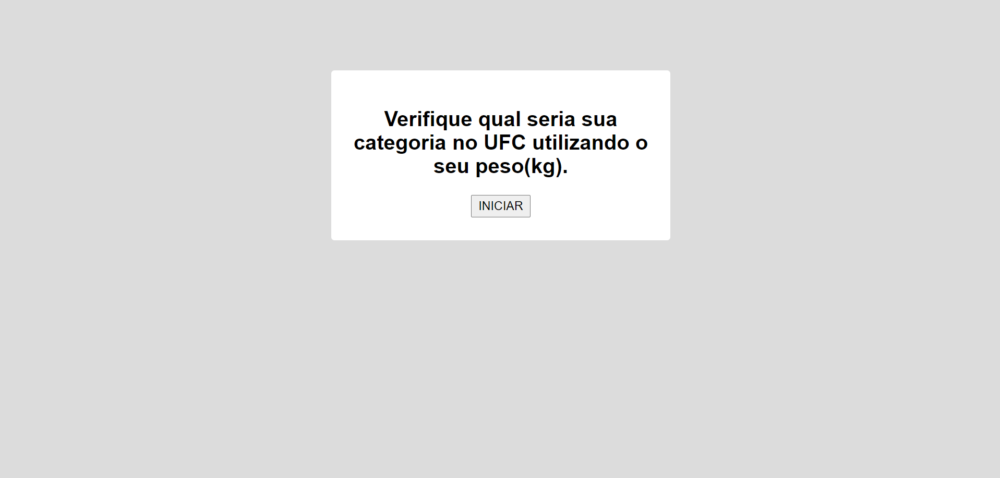
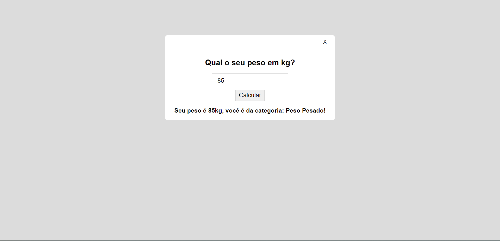

# Este programa coleta um número de "peso" em kg retorna uma modalidade do UFC baseada no "peso".

### Tecnologias utilizadas:
- HTML
- CSS
- Javascript

## Tela incial com o botão de iniciar:

## Segunda tela na qual se insere a informação e onde na qual também se apresenta o resultado:
- botão de X faz com que o programa volte a tela inicial
